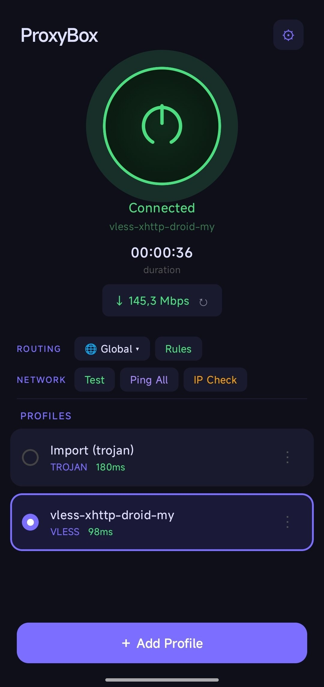
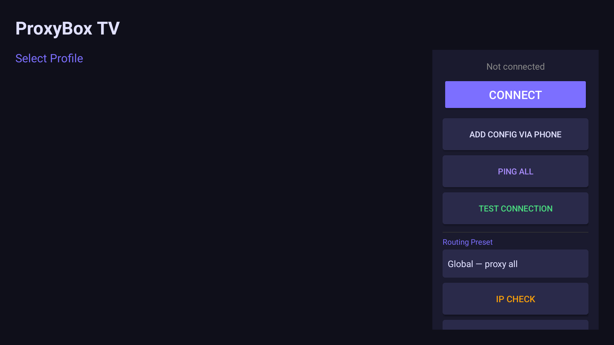
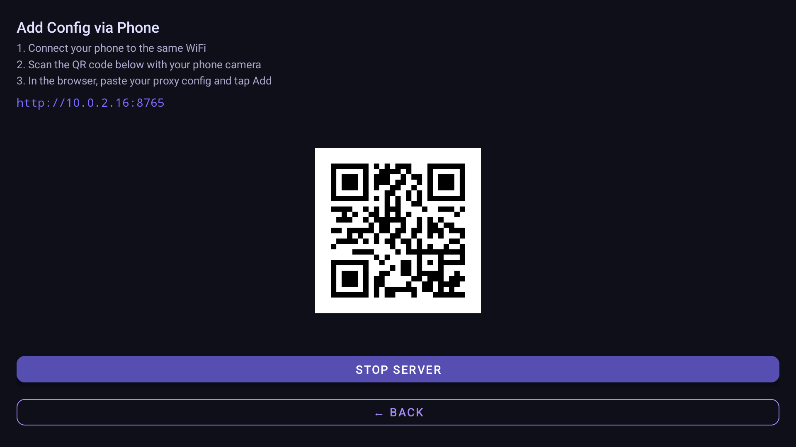

# ProxyBox

[](README_ru.md)


Open-source Android VPN client powered by [Xray-core](https://github.com/XTLS/Xray-core). Designed for both **mobile phones** and **Android TV / set-top boxes**.

> **Why ProxyBox?** Full Android TV support with D-pad navigation, phone-to-TV config transfer via QR code, and a clean modern UI — features missing from most Xray clients.

## Donate

If you find this project useful, consider supporting development:

**USDT (TRC20):** `TMWTigPZgTkekaRUjUrhJUNENFeUAE7T15`


## Screenshots

<p align="center">
  
  &nbsp;&nbsp;&nbsp;&nbsp;
  
  &nbsp;&nbsp;&nbsp;&nbsp;
  
</p>

<p align="center">
  <em>Mobile &nbsp;·&nbsp; Android TV &nbsp;·&nbsp; Phone-to-TV Config Transfer</em>
</p>

## Features

- **Multi-protocol support**: VLESS, VMess, Shadowsocks, Trojan, Hysteria2
- **Transport layers**: TCP, WebSocket, gRPC, HTTP/2, QUIC, KCP, HTTPUpgrade, XHTTP (SplitHTTP)
- **Security**: TLS, Reality, None
- **Android TV optimized**: dedicated TV interface with D-pad navigation and Leanback launcher support
- **Config import methods**:
  - Paste URL or raw JSON manually
  - Scan QR code with camera
  - Pick QR code image from gallery
  - Local HTTP server with QR code — scan from phone to add configs to TV/box
  - Subscription URLs with auto-refresh
- **Connection testing**: TCP ping for all profiles + HTTP connectivity test (google.com/generate_204)
- **Auto-update geo databases**: geoip.dat and geosite.dat from [v2fly](https://github.com/v2fly/geoip) via WorkManager (daily, Wi-Fi only)
- **Boot auto-start**: automatically reconnect VPN after device reboot
- **Local storage**: all configs stored locally in Room database
- **Full JSON config import**: accepts complete xray/v2ray configs with automatic dependent outbound preservation (frag-proxy, WARP chains via `dialerProxy` / `proxySettings.tag`)

## Security & Anti-Detection

ProxyBox hardens the local proxy stack to minimize the attack surface and reduce VPN fingerprinting. Verified with [RKN Hardering](https://github.com/xtclovver/RKNHardering):

- **Authenticated local SOCKS proxy** — per-session random credentials (user/pass) generated on every connect. Other apps on the device cannot use or detect the local proxy without knowing the password
- **No HTTP proxy exposed** — only SOCKS inbound on localhost, no secondary HTTP listener
- **No Xray gRPC/API endpoint** — stats and API inbounds are not created
- **Full tunnel** — all traffic is routed through the VPN, preventing other apps from bypassing it via a direct connection
- **Not in known VPN app databases** — package name is not flagged by common VPN detection services

> **Note:** Some detection signals like `TRANSPORT_VPN`, `tun0` interface, and `NET_CAPABILITY_NOT_VPN` absence are inherent to the Android VPN API and cannot be avoided by any userspace VPN app.

## Architecture

```
com.dave_cli.proxybox
├── core/
│   ├── CoreService.kt          # VPN service (TUN interface + xray engine)
│   ├── XrayManager.kt          # Xray core lifecycle (CoreController API)
│   ├── ConfigBuilder.kt        # Builds xray JSON config from profile
│   ├── GeoFileManager.kt       # Downloads geoip/geosite with ETag caching
│   ├── GeoUpdateWorker.kt      # WorkManager periodic updater
│   ├── ProxyEngine.kt          # Engine interface
│   └── BootReceiver.kt         # Auto-start on boot
├── data/
│   ├── db/                     # Room database (ProfileEntity, SubscriptionEntity)
│   └── repository/             # ProfileRepository (CRUD, ping, subscriptions)
├── import_config/
│   ├── ConfigParser.kt         # Parses vless://, vmess://, ss://, trojan://, hy2://, JSON
│   ├── SubscriptionParser.kt   # Decodes base64 subscription content
│   └── QrDecoder.kt            # Decodes QR codes from bitmap images
├── server/
│   ├── LocalConfigServer.kt    # NanoHTTPD server for phone-to-TV config transfer
│   └── QrGenerator.kt          # Generates QR code bitmaps
├── ui/
│   ├── main/                   # Mobile UI (MainActivity, ProfileAdapter)
│   ├── tv/                     # Android TV UI (TvMainActivity, TvProfileAdapter)
│   ├── add/                    # Add profile screen
│   └── server/                 # Local server screen with QR display
└── ProxyBoxApp.kt              # Application class (schedules geo updates)
```

## Requirements

- Android 7.0+ (API 24)
- Xray core via [AndroidLibXrayLite](https://github.com/2dust/AndroidLibXrayLite) (`libv2ray.aar`)

## Building

```bash
# Clone the repository
git clone https://github.com/DaveBugg/ProxyBox.git
cd ProxyBox

# Build debug APK
./gradlew assembleDebug

# APK location
# app/build/outputs/apk/debug/app-debug.apk
```

> **Note**: The project includes `libv2ray.aar` in `app/libs/`. This contains the Xray core compiled for armeabi-v7a, arm64-v8a, x86, and x86_64.

## Adding Configs

### On Phone
1. Open app → tap **+ Add**
2. Paste a config URL (e.g. `vless://...`) or full JSON
3. Or scan a QR code with camera / pick QR image from gallery

### On Android TV / Box
1. Open app → select **Add Config via Phone**
2. Scan the displayed QR code with your phone
3. Browser opens → paste config URL, JSON, upload QR image, or add subscription

### Subscriptions
Add a subscription URL in the Add Config screen or via the local server web page. Profiles are fetched and stored automatically.

## Tech Stack

- **Language**: Kotlin
- **VPN Core**: Xray (via libv2ray.aar, CoreController API)
- **Database**: Room
- **Async**: Kotlin Coroutines + StateFlow
- **Networking**: OkHttp, NanoHTTPD
- **QR**: ZXing
- **Background tasks**: WorkManager
- **TV**: AndroidX Leanback

## License

This project is licensed under the GNU General Public License v3.0. See [LICENSE](LICENSE) for details.

## Credits

- [Xray-core](https://github.com/XTLS/Xray-core) — proxy engine
- [AndroidLibXrayLite](https://github.com/2dust/AndroidLibXrayLite) — Android bindings
- [v2rayNG](https://github.com/2dust/v2rayNG) — reference implementation
- [v2fly/geoip](https://github.com/v2fly/geoip) — geo databases
